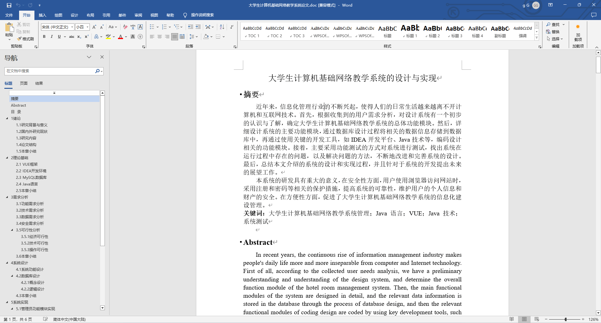
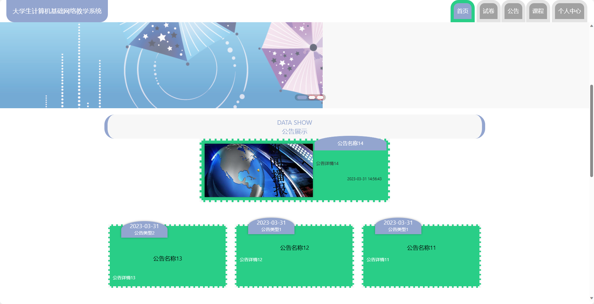
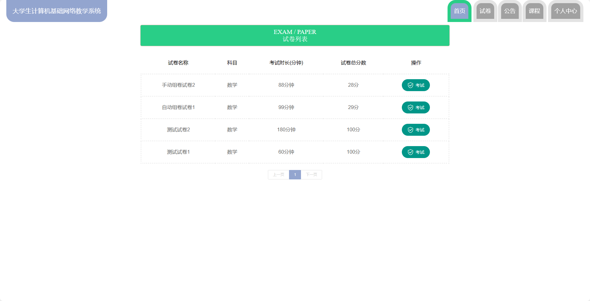
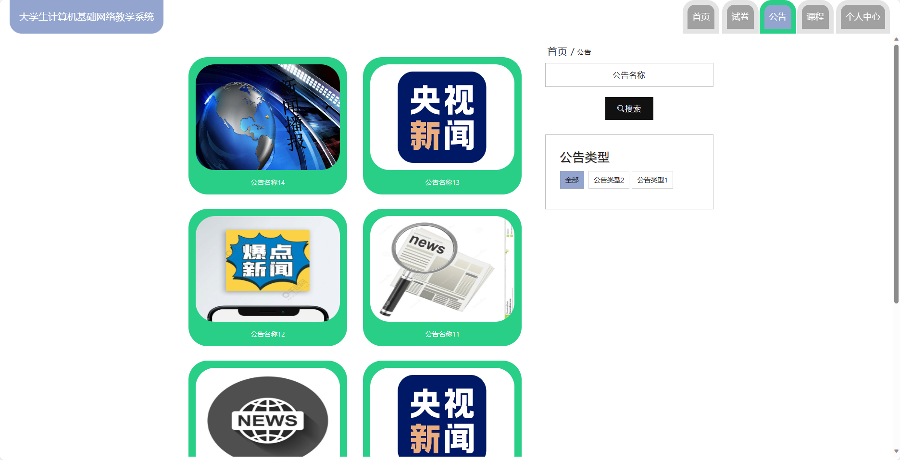
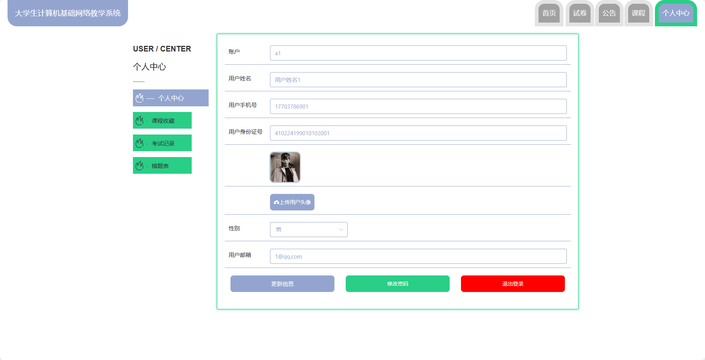
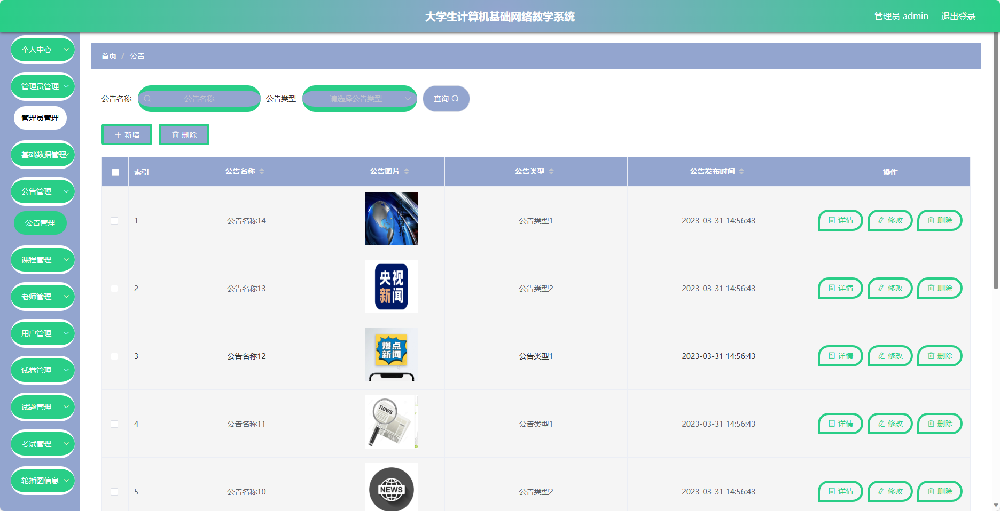
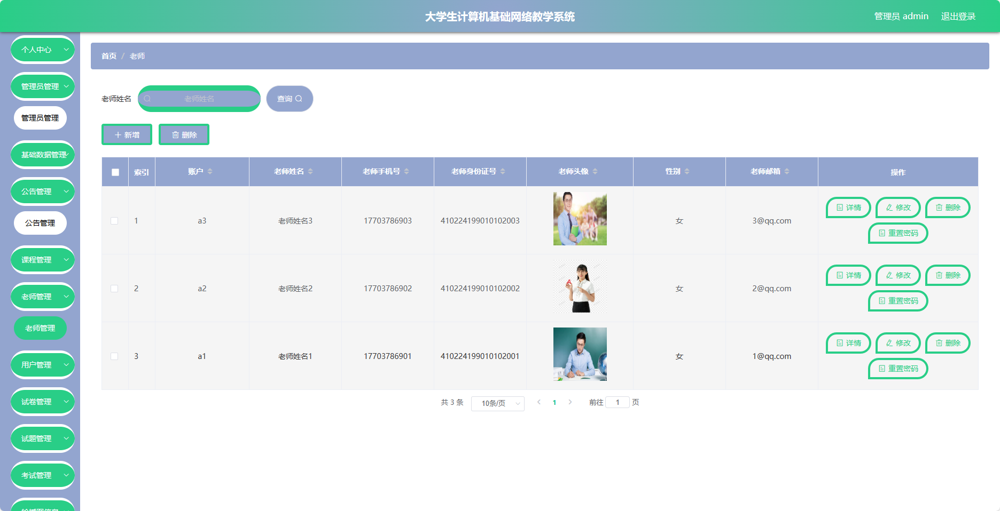
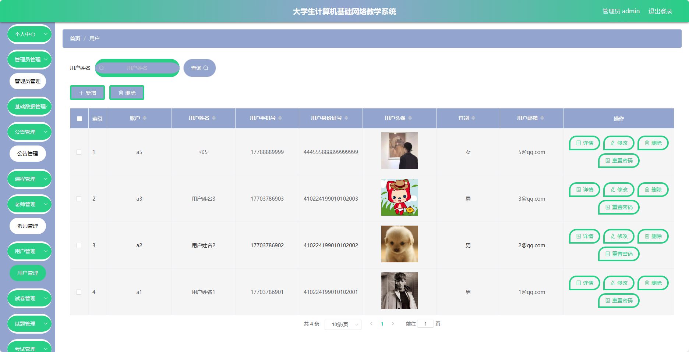

## 基于SpringBoot的大学生计算机基础网络教学系统(程序+报告)

###  获取sql数据库文件: 从戎源码网 (https://armycodes.com/) QQ: 386869957 QQ群: 377586148
###  所有系统地址: (https://github.com/YuLin-Coder/AllProjectCatalog) 
###  所有项目以及源代码本人均调试运行无问题 可支持远程安装部署调试、定制修改、代码讲解

## 项目介绍
基于SpringBoot的大学生计算机基础网络教学系统，系统包含三种角色：管理员、老师、用户,系统分为前台和后台两大模块，主要功能如下。

### 【管理员】:
- 个人中心：管理个人信息和账户。
- 管理员管理：对系统中的管理员账号进行管理和权限设置。
- 基础居管：管理系统的基础设置，如系统参数配置、日志管理等。
- 公告管理：发布和管理系统中的公告信息。
- 课程管理：管理系统中的课程信息，包括新增、编辑、删除等操作。
- 老师管理：管理系统中的教师信息，包括新增、编辑、删除等操作。
- 用户管理：管理系统中的用户信息，包括学生和其他用户的管理。
- 试卷管理：管理系统中的试卷信息，包括新增、编辑、删除等操作。
- 试题管理：对试题库进行管理，包括试题的录入、编辑和删除等操作。
- 考试管理：管理在线考试的安排和监控。
- 轮播图信息：管理系统首页轮播图的内容和链接。

### 【老师】:
- 个人中心：管理个人信息和账户。
- 公告管理：发布和管理课程相关的通知和公告。
- 课程管理：编辑所负责的课程信息，包括章节设置、资料上传等。
- 用户管理：查看学生信息和学习进度。
- 试卷管理：创建和编辑考试试卷。
- 试题管理：管理个人的试题库，包括试题的录入、编辑和删除等操作。
- 考试管理：安排和监控学生的在线考试。

### 【前台】:
- 首页：展示系统的概况、热门课程、公告等信息。
- 试卷：提供学生在线参与测试和练习的功能。
- 公告：发布学校或课程相关的通知和公告。
- 课程：展示各类课程信息，包括课程介绍、教学资料等。
- 个人中心：学生个人信息管理、课程学习记录等。

## 项目技术
- 编程语言：Java
- 数据库：MySQL
- 项目管理工具：Maven
- 前端技术：HTML、CSS、JavaScript、Jquery、Vue
- 后端技术：Spring、SpringMVC、MyBatis

## 运行环境
- JDK版本：JDK1.8及以上
- 开发工具：IDEA、Ecplise、Myecplise都可以
- 数据库: MySQL5.7及以上
- Maven：maven3.0及以上
- Node：14.14.0及以上

## 运行截图

